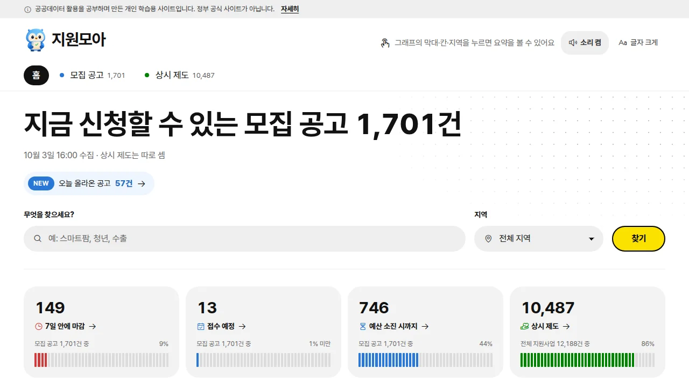
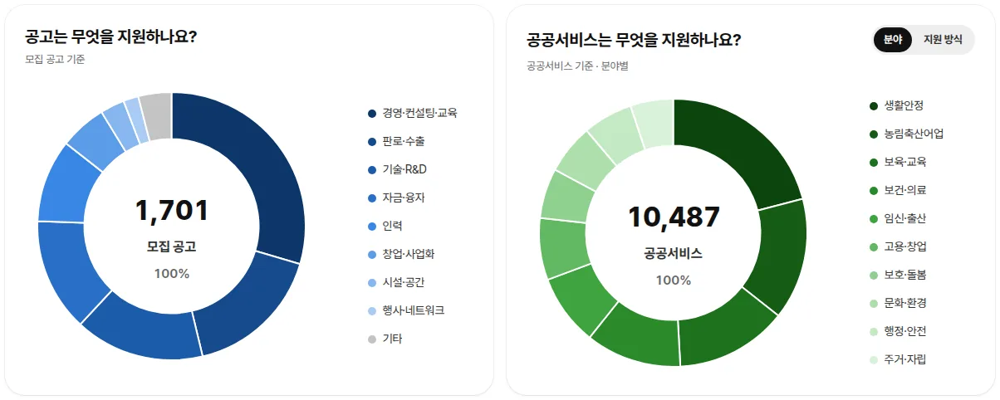
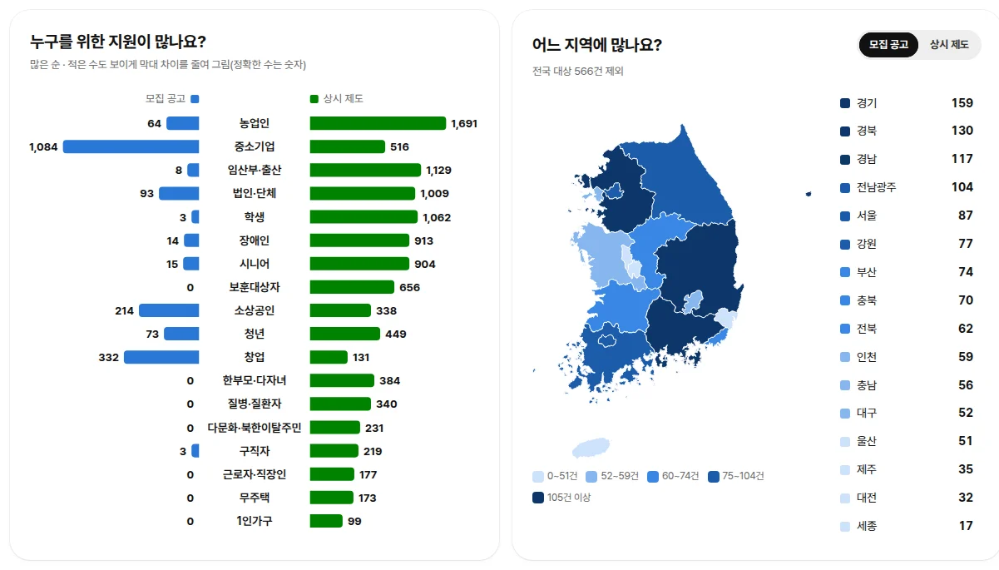
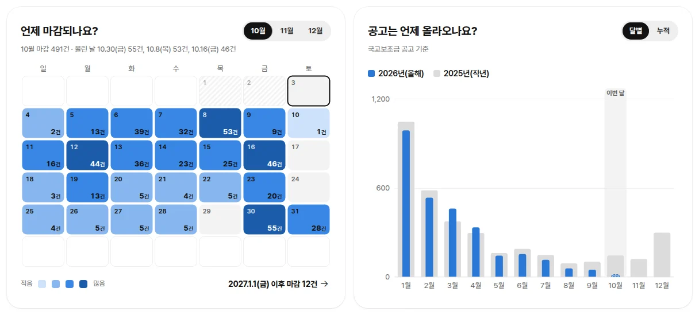
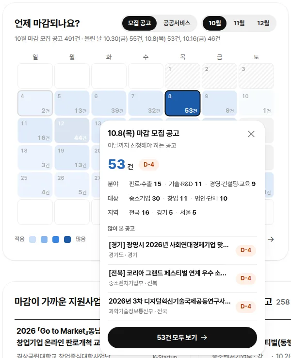
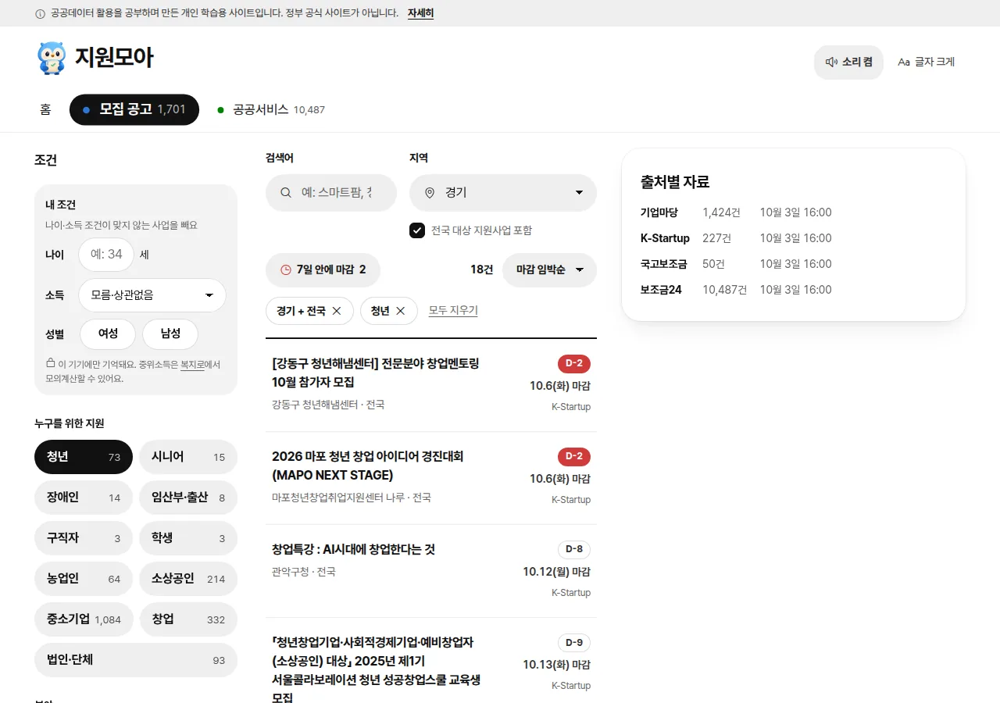
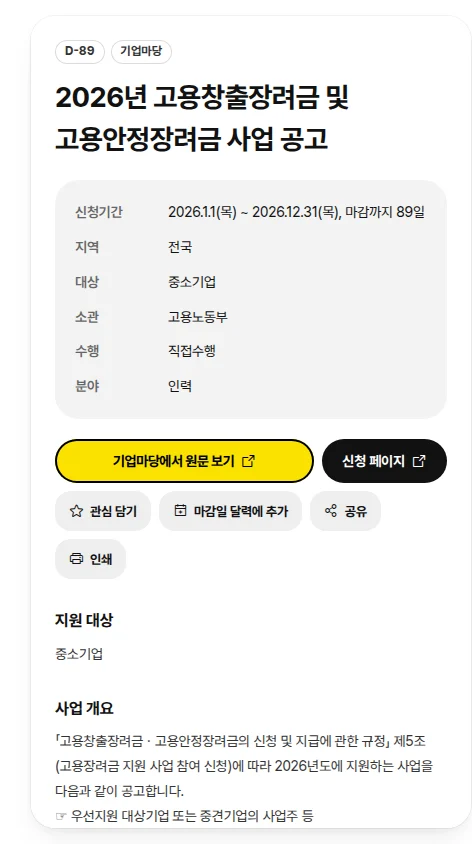
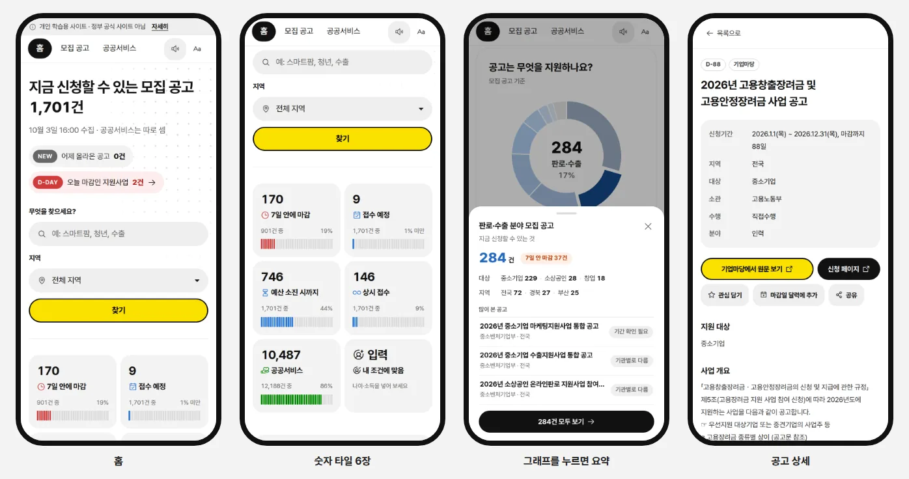

<div align="center">

# 🦉 지원모아

**흩어진 정부·지자체 지원사업을 한곳에 모아, 나에게 맞는 것을 쉽게 찾는 사이트**

### 👉 [jiwonmoa.orfa.shop](https://jiwonmoa.orfa.shop)

🔄 하루 두 번 새로 모음 · 📋 모집 공고 약 1,700건 · 🏛️ 상시 제도 약 1만 500건 · 💸 무료 · 🙈 가입 없음

</div>

- 최근 점검: 정상 (10.3(토) 16:30, [점검 기록](status/checks.md))

> ℹ️ 공공데이터 활용을 공부하며 만든 **개인 학습용 사이트**입니다. 정부 공식 사이트가 아니며, 신청 전에는 꼭 원문 공고를 확인하세요.

---

## 📌 목차

- [🤔 어떤 사이트인가요?](#-어떤-사이트인가요)
- [🏠 홈 화면 둘러보기](#-홈-화면-둘러보기)
- [📊 그래프로 한눈에 보기](#-그래프로-한눈에-보기)
- [🔍 원하는 지원사업 찾기](#-원하는-지원사업-찾기)
- [📄 공고 자세히 보기](#-공고-자세히-보기)
- [📱 휴대폰에서도 편하게](#-휴대폰에서도-편하게)
- [🗂️ 자료는 어디서 오나요?](#️-자료는-어디서-오나요)
- [🔒 개인정보는 어떻게 다루나요?](#-개인정보는-어떻게-다루나요)
- [🛠️ 직접 실행해 보기 (개발자용)](#️-직접-실행해-보기-개발자용)
- [📜 출처와 라이선스](#-출처와-라이선스)

---

## 🤔 어떤 사이트인가요?

정부와 지자체, 공공기관의 지원사업은 기업마당, K-Startup, 보조금24 같은 여러 사이트에 **나뉘어** 올라옵니다.
지원모아는 이 사이트들의 공개 자료(공공데이터포털 API)를 **하루 두 번 자동으로 모아서**, 한 화면에서 비교하고 찾을 수 있게 정리합니다.

지원사업은 두 종류로 나눠 보여 줍니다.

| 구분 | 뜻 | 예시 | 어디서 모으나 |
|---|---|---|---|
| 🔵 **모집 공고** | 신청 기간이 정해진 공고 | "2026년 수출 바우처 참여기업 모집" | 기업마당 · K-Startup · 국고보조금 |
| 🟢 **상시 제도** | 기간 없이 언제든 신청하는 제도 | "근로·자녀장려금", "청년 월세 지원" | 보조금24 |

이렇게 쓰면 좋아요 👇

- 👨‍🌾 **농업인**이라면 → '농업인'을 고르고 과수·축산 같은 세부 분야로 좁혀 보기
- 🧑‍💼 **소상공인·중소기업**이라면 → 내 지역 + '7일 안에 마감' 공고부터 확인하기
- 🧑‍🎓 **청년·어르신·가족**이라면 → 나이와 소득을 넣고, 나에게 해당하는 상시 제도만 골라 보기

---

## 🏠 홈 화면 둘러보기



홈 화면에서는 지금 상황을 한눈에 볼 수 있습니다.

- 🔢 **지금 신청할 수 있는 모집 공고 N건**: 마감된 공고는 빼고 센 숫자입니다.
- 🆕 **오늘 올라온 공고 / ⏰ 오늘 마감인 공고**: 누르면 그 공고만 목록으로 모아 보여 줍니다.
- 🔎 **검색과 지역 선택**: '스마트팜', '청년', '수출'처럼 낱말로 찾고, 지역을 고르면 홈의 모든 숫자와 그래프가 그 지역 기준으로 바뀝니다.
- 📈 **숫자 타일**: 7일 안에 마감 · 접수 예정 · 예산 소진 시까지 · 상시 제도. 누르면 바로 해당 목록으로 갑니다.
- ⭐ **관심 담은 지원사업**: 상세 화면에서 '관심 담기'를 누른 공고가 홈 맨 위에 모입니다. 마감이 가까운 순서로 보여 주고, 담은 뒤 마감일이 바뀌면 알려 줍니다.
- 👥 **나에게 맞는 지원 찾기**: 청년, 농업인, 소상공인 등 18가지 대상 중 하나를 누르면 그 대상의 지원사업이 바로 나옵니다.

---

## 📊 그래프로 한눈에 보기

홈에는 그래프가 6개 있습니다. **그래프의 막대·칸·지역을 누르면** 바로 목록으로 넘어가지 않고 **요약 창**이 먼저 떠서, 건수와 많이 본 공고를 미리 볼 수 있습니다.

### 🍩 무엇을 지원하나요?



- 모집 공고(파랑)와 상시 제도(초록)가 **어떤 분야에 많은지** 보여 줍니다.
- 조각이나 오른쪽 이름에 마우스를 올리면 가운데에 **건수 · 이름 · 비율**이 나타납니다.
- 상시 제도는 '분야'와 '지원 방식(현금·감면·융자…)' 두 가지로 바꿔 볼 수 있습니다.

### 👥 누구를 위한 지원이 많나요? · 🗺️ 어느 지역에 많나요?



- **나비 그래프**: 가운데 대상 이름을 기준으로 왼쪽은 모집 공고, 오른쪽은 상시 제도 건수입니다.
- **지역 지도**: 색이 진할수록 그 지역만을 위한 지원사업이 많습니다. 지역을 누르면 요약과 함께 '홈 화면을 이 지역 기준으로 보기' 단추가 나옵니다.

### 📅 언제 마감되나요? · 📆 공고는 언제 올라오나요?



- **마감 달력**: 보통 달력 모양으로 날짜마다 마감하는 공고 수를 보여 줍니다. 색이 진할수록 마감이 몰린 날입니다.
- **달별 공고**: 국고보조금 공고가 몇 월에 많이 올라오는지 올해(파랑)와 작년(회색)을 비교합니다. '누적'으로 바꾸면 1월부터 쌓인 수를 볼 수 있습니다.

### 👆 누르면 뜨는 요약 창



달력에서 10월 8일 칸을 누르면 그날 마감하는 **53건의 분야·대상·지역**과 **많이 본 공고 3건**이 보이고, '53건 모두 보기'로 전체 목록에 갈 수 있습니다.

> 💡 홈 맨 아래에는 카드가 셋 있습니다.
> - **곧 올라올 수 있는 공고**: 작년 이맘때 접수를 시작한 국고보조금 공고를 미리 보여 주어, 올해 공고가 뜨기 전에 준비할 수 있습니다.
> - **곧 접수가 시작되는 공고**: 이미 공고가 났고 7일 안에 신청을 받기 시작하는 공고입니다.
> - **새로 생긴 상시 제도**: 보조금24에 최근 30일 안에 새로 생긴 제도입니다.

---

## 🔍 원하는 지원사업 찾기



'모집 공고'나 '상시 제도' 탭에서 조건을 골라 좁혀 볼 수 있습니다.

| 조건 | 설명 |
|---|---|
| 🙋 **내 조건** | 나이 · 소득(중위소득 구간) · 성별을 넣으면, 조건이 맞지 않는 사업을 빼 줍니다. 이 기기에만 기억해요. |
| 👥 **누구를 위한 지원** | 청년, 시니어, 장애인, 농업인, 소상공인, 중소기업 등 18가지 |
| 🌾 **농업 세부 분야** | '농업인'을 고르면 과수·원예, 축산·방역, 스마트팜 등 11가지가 더 나와요 |
| 🗂️ **분야** | 모집 공고 9가지(자금·융자, 기술·R&D, 판로·수출…), 상시 제도 10가지(생활안정, 보육·교육…) |
| 💰 **지원 방식** | 상시 제도만: 현금, 감면, 융자, 현물, 이용권 등 |
| 🚦 **신청 상태** | 접수 중 · 접수 예정 · 예산 소진 시까지 · 상시 등 |
| 📍 **지역** | 16개 시도(광주·전남은 하나로), '전국 대상 지원사업 포함' 여부 |

- 정렬: 마감 임박순 · 최근 등록순 · 최근 수정순 · 이름순
- 마감 배지: 🔴 오늘~D-3, 🟠 7일 안, 그 밖은 회색 테두리
- 🔗 고른 조건은 주소에 담기기 때문에, **링크를 보내면 같은 결과**를 볼 수 있습니다.

---

## 📄 공고 자세히 보기



공고를 누르면 오른쪽(휴대폰은 전체 화면)에 상세 내용이 열립니다.

- 🗓️ **신청 기간과 D-day**, 지역 · 대상 · 소관 기관 · 분야
- 📝 지원 대상 · 사업 개요 · 지원 내용 · 신청 방법 · 선정 기준 · 구비 서류
- 📎 **공고문·첨부 파일** (기업마당 공고)
- 📞 **문의처**: 전화번호를 누르면 바로 전화, 메일을 누르면 메일 쓰기
- 🔗 **원문 보기 / 신청 페이지**: 원래 사이트로 바로 이동

그리고 이런 단추가 있어요.

- ⭐ **관심 담기**: 홈 맨 위에 모아 두기
- 📅 **마감일 달력에 추가**: 홈 마감 달력에 검은 점으로 표시
- 📤 **공유**: 휴대폰 공유 창(카톡 등)으로 보내기
- 🖨️ **인쇄**: 공고 내용만 A4 한 장으로 깔끔하게
- 🧭 **비슷한 지원사업 3건**: 같은 분야·대상·지역의 다른 공고 추천

<br clear="right">

---

## 📱 휴대폰에서도 편하게



- 📲 휴대폰에서는 위쪽을 탭 줄 하나로 줄여 화면을 넓게 씁니다. 스크롤해도 탭과 단추가 늘 위에 있어요.
- 👆 그래프를 누르면 **아래에서 요약 시트**가 올라옵니다. '뒤로 가기'를 누르면 시트만 닫혀요.
- 🔠 **글자 크게** 단추로 모든 글자를 키울 수 있고, 🔊 **버튼 소리**도 켜고 끌 수 있습니다.
- ♿ 키보드만으로도 쓸 수 있고, 화면 낭독기가 모든 단추 이름을 읽을 수 있게 만들었습니다. '움직임 줄이기'를 켜 둔 기기에서는 그래프가 움직이지 않습니다.

---

## 🗂️ 자료는 어디서 오나요?

모든 자료는 [공공데이터포털](https://www.data.go.kr)의 공개 API에서 가져옵니다.

| 출처 | 내용 | 비고 |
|---|---|---|
| 🏢 중소벤처기업부 **기업마당** (15157820) | 중소기업 지원사업 공고 | 게시 중인 공고, 공고문·첨부 파일 포함 · 공공누리 제3유형 |
| 🚀 창업진흥원 **K-Startup** (15125364) | 창업 지원사업 공고 | 모집 중인 공고, 민간 주관 공고 포함 |
| 🏛️ 행정안전부 **보조금24** (15113968) | 중앙·지자체 공공서비스(상시 제도) | 지원 조건(나이·소득 등)과 상세(구비서류·신청 방법) 포함 |
| 💰 기획예산처 **국고보조금 공모** (15156853) | 국고보조사업 공모 공고 | 작년·올해·내년 사업 |

### 🔄 이렇게 돌아가요

```text
 매일 09:00 · 16:00                                         매일 09:30 · 16:30
┌──────────────┐   ┌──────────────┐   ┌──────────────┐   ┌──────────────┐
│ 공공데이터포털 │ → │ 정리·분류     │ → │ 화면 자료 생성 │ → │ 자동 점검      │
│ API 4종 수집  │   │ (지역·대상·분야)│   │ (사이트 반영)  │   │ (결과 기록)    │
└──────────────┘   └──────────────┘   └──────────────┘   └──────────────┘
```

- 한 출처가 실패해도 나머지는 그대로 반영하고, 실패한 출처는 이전 자료를 보여 주며 화면에 '수집 실패'를 표시합니다.
- 수집이 끝나고 30분 뒤 자동 점검이 수집 성공 여부 · 자료 이상 · 사이트 응답 · 규칙 테스트를 확인하고, 결과를 [점검 기록](status/checks.md)에 남깁니다.

---

## 🔒 개인정보는 어떻게 다루나요?

- 🙅 **가입·로그인이 없고**, 이름·연락처 같은 개인정보를 받지 않습니다.
- 📱 관심 담기 · 마감일 달력 · 내 조건(나이·소득·성별) · 글자 크기 설정은 **지금 쓰는 브라우저 안에만** 저장되고 서버로 보내지 않습니다.
- 🍪 쿠키나 방문 분석 도구를 쓰지 않습니다.
- 🛡️ 보안 헤더(HTTPS 고정·콘텐츠 보안 정책 등)로 이 사이트와 글꼴 서버(jsDelivr) 밖의 스크립트는 실행되지 않게 막습니다.
- 🧹 브라우저의 사이트 데이터를 지우면 저장된 내용도 모두 사라집니다.

---

## 🛠️ 직접 실행해 보기 (개발자용)

<details>
<summary><b>펼쳐 보기</b> — 폴더 구성, 실행 방법, 테스트</summary>

### 📁 폴더 구성

```text
collector/        공공 API 수집 → SQLite 정리 → 화면용 자료 생성 (Python 표준 라이브러리만 사용)
site/             정적 웹 화면 (HTML·CSS·JS, 빌드 도구 없음)
  vendor/         대한민국 지도 SVG
deploy/           서버 운영: 갱신(update.sh), 점검(check.sh), 호스팅 준비, 운영 안내
docs/             API 규격 원본(api-specs/), 개발 노트(DEVELOPMENT.md), README 그림(images/)
status/           자동 점검 기록(checks.md)
tests/            수집·분류 규칙 테스트
```

### ⚙️ 준비

1. Python 3.9 이상
2. [공공데이터포털](https://www.data.go.kr)에서 위 '자료 출처'의 API 4개를 활용 신청하고 일반 인증키를 받습니다.
3. `.env.example`을 `.env`로 복사하고 `DATA_GO_KR_KEY`에 인증키를 넣습니다. `.env`는 저장소에 올리지 않습니다.

### ▶️ 실행

```bash
python collector/probe.py                 # API 연결 점검(출처별 3건)
python collector/collect.py               # 전체 수집 → data/hub.db (약 5~10분, 국고보조금이 대부분)
python collector/collect.py --reprocess   # 판정 규칙만 고쳤을 때: 새로 받지 않고 다시 정리
python collector/build_site.py            # 화면용 자료 site/data/ 생성
python collector/report.py                # (선택) 점검 보고서 reports/ + 엑셀용 CSV data/export/
```

`site/index.html`을 브라우저로 열면 됩니다(서버 불필요). 주소 공유·뒤로 가기까지 확인하려면:

```bash
python -m http.server 8765 --directory site   # http://127.0.0.1:8765
```

수집 자료(`data/`)와 화면용 자료(`site/data/`)는 저장소에 넣지 않습니다. 위 순서로 다시 만듭니다.

### ✅ 테스트

규칙을 고친 뒤에는 테스트를 돌립니다(표준 라이브러리만, GitHub Actions에서도 같은 명령).

```bash
python -m unittest discover -s tests -v
```

### ⏰ 운영

- 갱신: 매일 09:00·16:00(한국 시간) `deploy/update.sh`. 한 번에 10분쯤 걸립니다.
  '현재 자료'는 출처별 마지막 성공 수집 시각에 보인 것(`notices.seen_at`)이라, 오전에 있다가 오후에 사라진 공고는 오후부터 빠집니다.
- 점검: 매일 09:30·16:30 `deploy/check.sh` → [status/checks.md](status/checks.md)
- 서버 설치·예약 방법은 [deploy/README.md](deploy/README.md)

### 📚 더 자세한 규칙

화면 세부 규칙(용어·색 체계·그래프·요약 창·내 조건 등)과 '어떤 규칙이 어느 파일에 있는지'는 **[개발 노트](docs/DEVELOPMENT.md)**에 정리했습니다.

</details>

---

## 📜 출처와 라이선스

- 💻 **코드**: [MIT](LICENSE)
- 🗺️ **지도**: [svg-maps South Korea](https://github.com/VictorCazanave/svg-maps/tree/master/packages/south-korea) (Victor Cazanave, 원본 [MapSVG](https://mapsvg.com/maps/south-korea)), [CC BY 4.0](https://creativecommons.org/licenses/by/4.0/). 광주·전남을 한 지역으로 합쳐 표시합니다.
- 🍮 **젤리 탭**: 맨 위 탭(홈·모집 공고·상시 제도)의 움직임은 [React Bits "Jelly Radio"](https://reactbits.dev/c/micro/jelly-radio)(David Haz, MIT + Commons Clause)를 이 사이트에 맞게 옮겨 썼습니다.
- 🎨 **화면 일부 무늬**: 배경 무늬·그래프 말풍선 꼬리·전환 단추 알약·체크 상자·불러오기 막대(`site/style.css`)는 [Uiverse.io](https://uiverse.io) 패턴
  (BadlyWrittenStylesheet, AspenBranch, johnliter, Pradeepsaranbishnoi, DaniloMGutavo, Nawsome)을 고쳐 썼습니다 — MIT License, © 2023 Uiverse.io. 출처는 각 규칙 주석에 적었습니다.
- 🗂️ **수집 자료**: 각 출처의 이용 조건을 따릅니다(기업마당은 공공누리 제3유형: 출처 표시·변경 금지).

<div align="center">

---

🦉 **지원모아** · 필요한 지원을, 놓치지 않게

</div>
